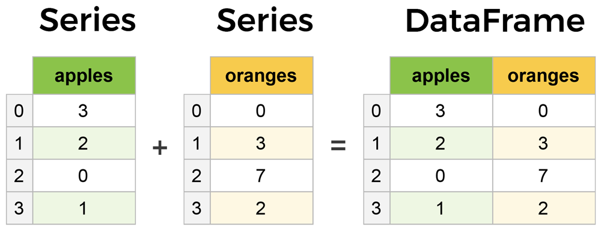

# 🐼 Pandas Core & Exploratory Data Analysis (EDA)

¡Bienvenido a este repositorio de aprendizaje práctico sobre **Pandas** y **Análisis Exploratorio de Datos (EDA)**! Este proyecto está estructurado a través de un cuaderno interactivo (`pnds.ipynb`) diseñado para guiarte paso a paso desde los fundamentos de la manipulación de datos en Python hasta la generación de insights visuales avanzados utilizando el dataset de películas de **IMDB (2006-2016)**.



---

## 🚀 Contenido del Notebook

El cuaderno [`pnds.ipynb`](pnds.ipynb) está dividido en secciones estratégicas que cubren todo el flujo de trabajo de un científico de datos:

### 1. 🍏 Introducción Práctica a DataFrames & Series
* **Estructuras Core de Pandas**: Creación y manipulación de `pd.Series` y `pd.DataFrame` desde estructuras nativas de Python (diccionarios y listas).
* **Acceso Dinámico**: Métodos de selección y extracción de columnas individuales.
* **Ejemplo Didáctico**: Simulación del stock de frutas (manzanas, naranjas y kiwis).


### 2. 📂 Carga & Inspección de Datasets
* **Carga Eficiente**: Uso del método `pd.read_csv()` para leer el dataset `data/imdb.csv` que contiene las 1,000 películas más populares de IMDB.
* **Exploración Inicial**: Métodos de previsualización rápida como `.head(n)` y `.tail(n)`.
* **Metadatos del Esquema**: Inspección de nombres de columnas y tipos de datos a través de `.columns` e `.info()`.

### 3. 🧼 Limpieza y Depuración de Datos (Data Cleaning)
* **Renombrado de Columnas**: Reemplazo de nombres complejos o con espacios para optimizar su consulta (ej. `Revenue (Millions)` a `Revenue_Millions`).
* **Tratamiento de Nulos (Missing Values)**:
  * Detección precisa de nulos con `df.isna().sum()`.
  * Eliminación sistemática de filas incompletas mediante `.dropna()`, reduciendo el dataset a **838 registros de alta calidad**.

> [!NOTE]
> Durante la etapa de exploración se identificaron 64 valores nulos (`NaN`) en la columna `Metascore` y 128 en `Revenue_Millions`. La limpieza asegura la precisión de los posteriores análisis estadísticos y visuales.

### 4. 📊 Estadísticas Descriptivas
* **Resumen Estadístico**: Uso de `.describe()` para obtener un panorama cuantitativo (media, desviación estándar, valores mínimos/máximos y cuartiles) de las variables numéricas.
* **Métricas Clave**: Operaciones agregadas directas como el cálculo de la calificación promedio global con `df.Rating.mean()`.
* **Clasificaciones únicas**: Extracción e inspección ordenada de calificaciones disponibles utilizando `.unique()` y `np.sort()`.

### 5. 🔍 Filtrado & Segmentación
* **Queries Booleanas**: Filtrado avanzado de registros basado en condiciones lógicas (ej. obtener las mejores películas con rating superior a `8.0`).
* **Distribución de Frecuencias**: Uso de `.value_counts()` para auditar la cantidad de producciones según su calificación.

### 6. 📈 Visualización Avanzada (Matplotlib & Seaborn)
* **Frecuencias de Calificación**: Gráfico de barras (`sns.barplot`) mostrando el volumen de películas por nota individual.
* **Distribución Continua**: Histograma estilizado (`sns.histplot`) enriquecido con una curva de densidad suave (`KDE`) para comprender la concentración de las notas.
* **Relación Calificación vs. Ingresos**: Gráfico de dispersión (`sns.scatterplot`) con transparencia (`alpha`) para mapear la correlación entre la recepción crítica de una película y su éxito comercial en taquilla.

---

## 📊 Vista General del Dataset IMDB

A continuación se detalla la estructura y variables analizadas en el archivo `data/imdb.csv`:

| Columna | Tipo de Dato | Descripción |
| :--- | :--- | :--- |
| **Rank** | `int64` | Posición del ranking de popularidad. |
| **Title** | `object` | Título original de la película. |
| **Genre** | `object` | Géneros cinematográficos asociados (separados por comas). |
| **Description** | `object` | Sinopsis de la obra. |
| **Director** | `object` | Nombre del director. |
| **Actors** | `object` | Elenco principal de actores. |
| **Year** | `int64` | Año de lanzamiento (2006 - 2016). |
| **Runtime (Minutes)** | `int64` | Duración del largometraje en minutos. |
| **Rating** | `float64` | Calificación otorgada por la comunidad de IMDB. |
| **Votes** | `int64` | Volumen total de votos emitidos por los usuarios. |
| **Revenue_Millions** | `float64` | Ingresos recaudados en taquilla (en millones de USD). |
| **Metascore** | `float64` | Puntuación crítica ponderada de Metacritic (0-100). |

---

## 🛠️ Requisitos e Instalación

Para ejecutar el notebook interactivamente en tu máquina local, sigue estos sencillos pasos:

1. **Clonar este repositorio** en tu espacio de trabajo local:
   ```bash
   git clone <URL_DEL_REPOSITORIO>
   cd pandas
   ```

2. **Instalar las dependencias esenciales** del stack de ciencia de datos:
   ```bash
   pip install pandas numpy seaborn matplotlib ipykernel
   ```

3. **Iniciar el servidor de Jupyter**:
   ```bash
   jupyter notebook
   ```
   *Abre el archivo `pnds.ipynb` y ejecuta las celdas secuencialmente.*

---

## 💡 Insights Destacados del Análisis

> [!TIP]
> * **Ingresos vs Calificación**: El gráfico de dispersión revela que la mayoría de los éxitos de taquilla más masivos (ingresos superiores a $300M) se concentran en el rango de calificación de **7.0 a 8.5**, sugiriendo que una excelente reputación crítica potencia fuertemente la venta de boletos.
> * **Distribución de Ratings**: La distribución de ratings tiene un sesgo hacia la izquierda, concentrando la mayor parte de las producciones en calificaciones de **6.5 a 7.5**, lo que refleja una crítica generalmente favorable o promedio en el cine comercial de la última década.


---
*Documentación estructurada y curada para el módulo de Fundamentos de Pandas y Análisis de Datos - 2026*
